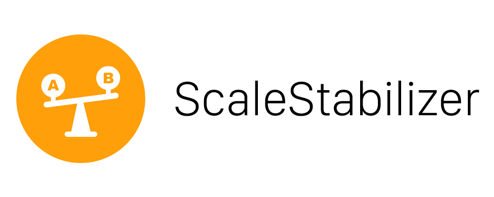
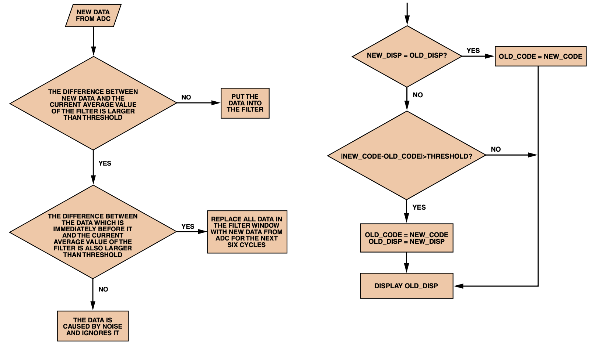

<p align="center">
  
  <h3 align="center">Simple library to stabilize load cell readings</h3></br>
  <p align="center">
    
    
    
  </p>
</p>
<br>

## About

Since the usage of load cells for accurate weight measurement is always correlated with measurement errors (ADC, hardware, ...), the implementation of a reliable error correction / stabilization code is necessary.

This library provides an easy way to accommodate for these errors without sacrificing measurement speed or the implementation of accurate timing measurements.

The idea for the two basic algorithms behind this library were borrowed from *Colm Slattery* *and Mariah Nie's* [A Reference Design for High-Performance, Low-Cost Weigh Scales | Analog Devices](https://www.analog.com/en/analog-dialogue/articles/a-reference-design-for-weigh-scales.html), which describes an excellent way to solve these problems.

## Basic principle

In the image below, you can see the two basic algorithms, which are used in the library. To further improve the results, an [Moving average](https://en.wikipedia.org/wiki/Moving_average) filter is used.



(Image copied from [A Reference Design for High-Performance, Low-Cost Weigh Scales](https://www.analog.com/en/analog-dialogue/articles/a-reference-design-for-weigh-scales.html))

## How can I use ScaleStabilizer in my project?

Simply include the library in your project, call the begin function in the setup part and then add the load cell measurements to the ScaleStabilizer object as follows.

**Note:** I've used a real word example below with measurements from an HX711 ADC and the according library.

```C
#include "HX711.h"
#include "ScaleStabilizer.h"

// Scale
const int DOUT_PIN = 23;
const int SCK_PIN = 22;
HX711 scale;

// Scale Stabilizer
const int WINDOW_SIZE = 10;
const double WEIGHT_THRESHOLD = 0.01;
ScaleStabilizer stabilizer;

void setup() {
  Serial.begin(115200);

  scale.begin(DOUT_PIN, SCK_PIN);
  scale.set_scale(720);
  scale.tare();

  stabilizer.begin(WINDOW_SIZE, WEIGHT_THRESHOLD);
}

void loop() {
  double adcReading = scale.get_units();
  stabilizer.add(adcReading);
  Serial.println(stabilizer.getStablilizedReading());
}
```

## Functions and Parameters

#### void begin(int windowSize, double weightThreshold)

- the call of this function is necessary to start the stabilizer
* @param windowSize represents the size of the moving window

* @param weightThreshold represents the weight/noise threshold - e.g. 0.1g

Try to adjust these two parameters to fit your project. The more you increase the windowSize, the smoother the output will be but at the same time the scale will become unresponsive.

Also weightThreshold or noise threshold will determine what you perceive as noise / measurement error and what should be real data. For example a weightThreshold of 0.01 means that every data change thats below +/- 0.0.1 is considered as noise.

#### void add(double reading)

- call this function to add a new data point to the ScaleStabilizer

- @param reading: ADC value/reading

#### double getStablilizedReading(double displayResolution = 0.1, int decimalPlaces = 1)

- returns the stabilized load cell reading

- @param displayResolution represents the output resolution - e.g. 0.1g accuracy

- @param decimalPlaces represents the decimal places present in the output

- @default values for the parameters are 0.1g and 1 decimal place

Try to adjust these two parameters to fit your project. Via the displayResolution you can set the expected output resolution. For example if you need a scale to only be able to display the weight in 0.5g steps, you can set the displayResolution to 0.5g and the output will be e.g. 15.0g ... 15.5g ... 16g ...

Accordingly, the parameter decimalPlaces allows you to set the preferred amount of decimal places e.g. decimalPlaces = 1 --> 15.5g or decimalPlaces = 2 --> 15.55g

## Limitations

This Software is provided as-is!

Please feel free to adapt it to your needs and contribute to the project. I would be very grateful to include your improvements. Thanks for your support!

**WARNING:** Everyone is responsible for what he/she is doing! I am not responsible if you hurt yourself, torch your house or anything that kind trying to do build something new! You are doing everything at your own risk!
